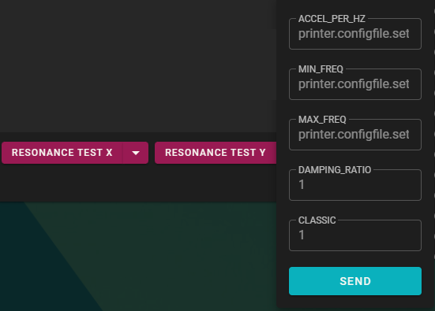
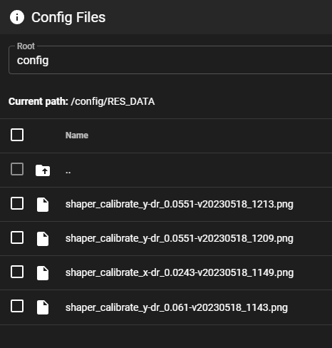
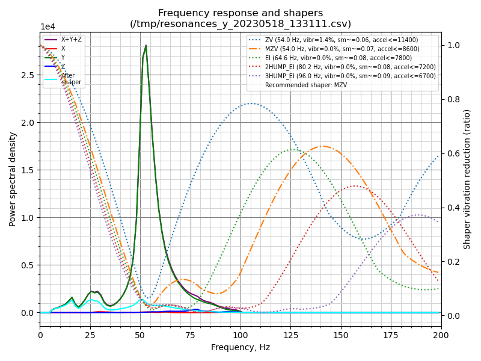
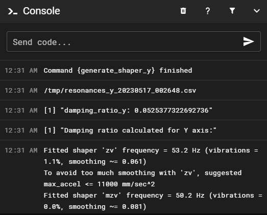

**Contents:**
- [ResHelper](#reshelper)
    - [What does this do?](#what-does-this-do)
- [Installation](#installation)
  - [Switching from a previous branch](#switching-from-a-previous-branch)
- [Usage](#usage)
  - [Support](#support)


<br>


# ResHelper 
A series of scripts designed to streamline Klipper's resonance testing workflow


### What does this do?

* Auto generates the resonance graph, and outputs the graph images into the config folder. These can be viewed directly in Mainsail/Fluid.
* Supports changing **accel_per_hz** at runtime without configuration changes 
* Compatible with both Mainline Klipper and Danger Klipper
* Supports Danger Klipper (BEv2) with classic shaper generation mode *
* The Damping Ratio is automatically computed and displayed in the console and appended to the graph image filename.  
* Throughout the process there is no need to connect to the PI by SSH or SFTP.  

<br>

*The inclusion of the smooth shapers in Danger Klipper (BEv2) changed the way the graphs are calculated and scored (rec accel, vibr% and frequency).* 
*A classic mode resonance testing mode is available for retaining compatibility and comparison with the normal branches*

<br>

# Installation


#### 1. Download and install ResHelper Scripts 


```
cd ~
git clone https://github.com/lhndo/ResHelper.git
cd ResHelper
./install.sh
```

<br>

*If you used an older version, please remove it first by running `rm -rf ResHelper `*

<br>

# Usage

#### 1. Run the Resonance Test Macros 
Run the `RESONANCE_TEST_X` or `RESONANCE_TEST_Y` macros
By clicking on the drop down arrow next to the macro button you can define the following settings:

<br>



<br>

`ACCEL_PER_HZ` - defines the intensity of the testing motion
*If your graphs measures below a 1e5 scale it is then recommended to increase ACCEL_PER_HZ in steps of +10 until it reaches that value (test between 80 and 190)*
*You can find more information in the [LH Stinger Tuning Guide](https://github.com/lhndo/LH-Stinger/wiki/Tuning#resonance-testing)*

`MIN_FREQ` - the frequency the resonance test starts at

`MAX_FREQ` - the frequency the resonance test ends

`DAMPING_RATIO` - enables/disables the damping ratio calculation

`CLASSIC` - active only in Danger Klipper BEv2 - enables/disables the "classic mode" resonance test


<br>

#### 2. View the graph images directly in the browser by going to MACHINE (Mainsail) and then opening the RES_DATA folder.
*The files are placed in ~/printer_data/config/RES_DATA/*<br>
<br>

<br>
*The damping ratio is displayed in the Console and appended to the filename.*<br><br>



<br>

#### 3. Add the resonance test results to your printer.cfg 
**Example:**
<pre><code>
[input_shaper]

shaper_freq_x: 68.2
shaper_type_x: mzv
damping_ratio_x: 0.055

shaper_freq_y: 54.0
shaper_type_y: zv
damping_ratio_y: 0.0523
</code></pre>

*For more information please consult: https://www.klipper3d.org/Resonance_Compensation.html*

<br>

*Enjoy!*
<br>


# Support

For support please join us on the [LH Stinger Discord](https://discord.gg/EzssCfnEDS)

<br>
<a href='https://ko-fi.com/lh_eng' target='_blank'> </a>


<br>

# Credits
*Based on work by **Dmitry**, **churls** and **kmobs***<br>
https://gist.github.com/kmobs/3a09cc28ec79e62f28d8db2179be7909
